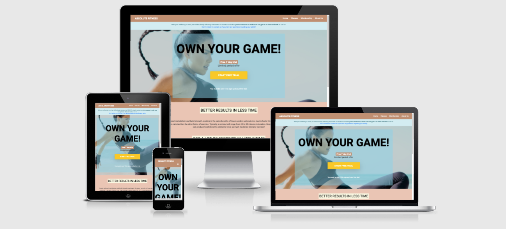
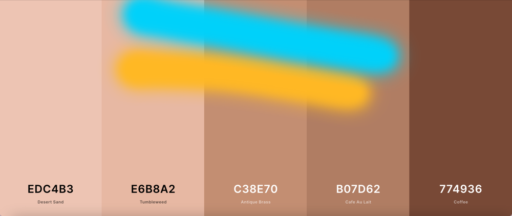

# Absolute Fitness

[View live website here!](#)

[View GitHub repository here!](#)

This website is created to brand a fitness studio "Absolute Fitness" (referred to "The studio" in readme), to get new members and to keep existing members. The Absolute Fitness's USP is that they are differentiated from other studios because they offer foremost; women a more effective training method (short classes with extremely high-intensity training that produces results quickly), wich also can be used from home. 

Since many trainingstudios, due to Covid-19, have had a hard time keeping and attracting new members, this studio can stand out by offering remote classes and a covid-safe workout studio. 
Also many women nowadays have a hard time finding time for exercise, this kind of training matches their needs as well.  

## **UX**

**User stories** 

As a first time visitor I want to:    

* learn about the studio so I can make a decision whether to be member or not. Does the studios serveces offers what I want and need. 
* be able to easily navigate and find general information about prices, location, classes etc.
* get a wow impression of the studio. Does it seem like a credible and inspiring place to me? Is it valuble enough for me, as a user, to stay and explore the studio site, and possibly even return?
* be able to get a free trial period to make a decision to buy a membership or not. It's common practice for studios to offer a free trial period. I might choose another studio if this one doensn't offer that.
* find out how this studio stands out from the crowd (the studios USP's *better results in less time and remote training*), why should I choose "Absolute Fitness" instead of someone else? 

As a returning visitor (existing member, potential member with training experience, potential member with no training experience) I want to:

* find schedules, contact information and current events.
* be able to easily navigate and find general information about prices, location, classes etc.
* be presented with an attractive membership offer and/or a free trial. I need that to make a decision if this is something for me (especially returning visitors with no training exprerience).  
* find out how this studio stands out from the crowd (the studios USP:s - better results in less time and remote training), why should I choose "Absolute Fitness" instead of someone else? 
* be asured that this traing method is compateble to me. I don't want to buy a membership, and then find out it's out of my leauge.

### Strategy 

**Project Goals**

The purpose of this project is to *"Build a website for a gym. ...Build a static front-end site to present useful information to users, using all the technologies that you have learned about so far.
Data is presented in a way that helps users achieve their goals, e.g. learning about a product/service that they are interested in. The presentation of this data advances the site owner's goals, e.g. helps them market a product/service."*
(*Code Institute Assessment Handbook*)

**Business Goals**

The business goal of the website is to increase the number of members (increase sales) and keep existing members by having an appealing site. This is "Absolute Fitness" fist website. 

Target audience: Women age 18-65 in the local area (as well as all over geographically, due to the studios remote classes) with limited time resources and women who want to maximize training results in less time than average workouts.

**Customer Goals**

Customer goals of the website is to get information about the studio and get a get a good idea of what it offers. Just as important is the feel the visitor gets about the sites/studios identity. It also allows the customer to take part of an offer. Lastly the costumer will see a professional and inspiring website with a mobile-first approach.

### Scope 

* The site is designed to signal energy, high end and modern.  

* CTA - call to action. The free trial button should draw user's attention immediatle (without the need to scroll) and gives the user the opportunity to try out the serveces. 

* An attractive and brief discription of the studios classes. 

* Schedule.

* Prices.

* Covid alert banner. Points out the studios high level of sanitation service to make members feel safe. The alert is easy to change to current offers/event etc.

* Contact information and opening hours. 

* Social medialinks.

### Structure

The website is designed to be consistent and intuitive, but at the same time eye catching. The most importent content is presented in the home page (offer and call to action as well). The business name is placed top-left corner, since users tend to read/look top-left corner moves down and right from there. 
 
The site consists of four pages. A header that includes business name and a navigation bar and a footer with social media links will be consistent troughout all pages. 

The site focuses on the offer and aims to attract their targetgroup by the style and images. Thats the fist thing a visitor sees. Then the goal is to visit the navlinks in the order they are set. Next step should be "Classes" where the visitor hopefully gets really interested and wants to be a member. Next step presents prices, that makes the vistor even more close to a decision. And lastly some contactinformation and the opportunity to contact the studio.

The information is briefly presented, there isn't not too much information, just enough to make the visitor interested. The visitor will not feel overwhelming (so the user doesn't leave the site and look for another site).

### Skeleton 

**Wireframes:** 

* [Mobile](https://github.com/jennymalmoe/Milestone-Project-1/tree/master/assets/docs/wireframes_mobile)
* [Tablet](https://github.com/jennymalmoe/Milestone-Project-1/tree/master/assets/docs/wireframes_tablet)
* [Desktop](https://github.com/jennymalmoe/Milestone-Project-1/tree/master/assets/docs/wireframes_desktop)

### Surface 

Design Choices

**Color Scheme:** 
The site represents highend and feminine values, with a clear message, and offer. The colors are soft, warm, inviting, encouraging, and modern. Characteristics that attract women. I added some accent colors (bright yellow and turquoise) that are used for emphasis my color scheme. These accent colors are bold and vivid and are used spairingly to create an eye catcing moment (used on call to actions buttons foremost). 

 

**Typography**:
The Roboto font is the main font used throughout the site with Sans-serif as the fallback font. Roboto was developed to balance content density and reading comfort and is pretty subtle, it doesn´t take any attention away from the content. The site has focused to get the visitors attention by powerful headlines. If the headline hooks the visitor, they tend to continue to read the body, if it doesn't they’ll leave. The headline is catchy, in bigger and bolder font, short, inspiring and get the visitor emotionally engaged.  

**Imagery**:
The sites images are all striking and modern. Most images is of women in a stylish and in a positive environment. 

**Icons**:
Icons used at the first page to set the tone for the sites design approach. 

## Technologies Used

### Languages
* HTML5 - provides the basic structure
* CSS3 - for styling

### Frameworks
* [Bootstrap "v4.1.3"](https://getbootstrap.com) - used for responsiveness and templates.  

Tools:

* [Git](https://git-scm.com/) - used for version control.
* [Gitpod](https://www.gitpod.io/) - online IDE.
* [GitHub](https://github.com/) -  hosting and version control.
* [Github Pages](https://pages.github.com/) - hosting service.
* [Pixelmator](https://www.pixelmator.com/mac/) - used to make the logo and map image.
* [DesignEvo](https://www.designevo.com/) - used to make the logo.
* [Coolors](https://coolors.co/) - used to establish color scheme.
* [Font Awsome](https://fontawesome.com/) - used for footer icons.
* [Imgur](https://imgur.com/) - to create url for images.
* [CSS-Tricks](https://css-tricks.com/) - used to the firstpage background image to cover the entire browser window.
 

Editors:

* [Balsamiq](https://balsamiq.com/) - used to create the wireframes.
* [Google Fonts](https://fonts.google.com/) - used to import fonts.
* [W3C Markup Validator](https://validator.w3.org/) -
* [W3C CSS Validator](https://validator.w3.org/) - 
* [Chrome DevTools](https://developer.chrome.com/docs/devtools/)  - used Lighthouse to check sites performance, accessibility, best practice and SEO. (and for browser) 
* [Unsplash](https://unsplash.com/) - Images used were obtained from Unsplash.
* [Am I Responsive](http://ami.responsivedesign.is/) - used for testing responsiveness of the site and the mock up image.
* [Google Maps](https://www.google.se/maps) - used for map image.

## Features

### Existing features

* CTA at homepage allows vistors to take part of a free trail offer by clicking the yellow button. 
* Contact form in About Us page allows visitor to contact the studio by fill out the form. 

### Features left to implement

Possibility to by membership online, to watch video samples of some of the classes, to book classes online and take part of the classes directly on website. 

## **Testing**

* [W3C Markup Validator](https://validator.w3.org/) -
* [W3C CSS Validator](https://validator.w3.org/) - 

Well, anything that you identify and can't fix, you need to document in the README. That will demonstrate that you've tested your app and are aware of the things that still need to be fixed.

## **Deployment**

## **Credits**

* My mentor Adegbenga Adeye for helpfull feedback througout the project.
* Fellow students on Slack for a helping hand when I've got stuck.
* Google for help!

